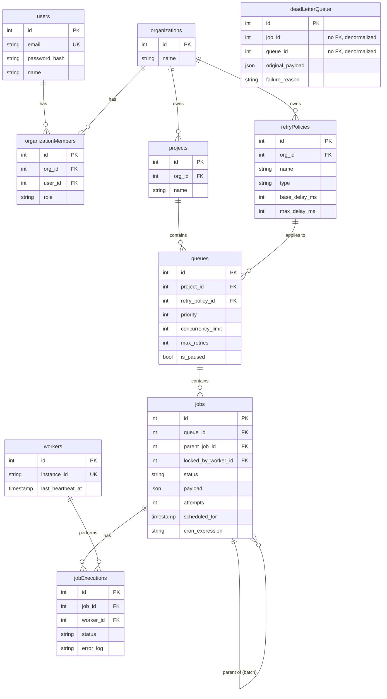

#  CronCruise: Serverless Distributed Job Scheduler

CronCruise is a production-inspired distributed job scheduling platform built as an "At-Least-Once Micro-Batch Executor," designed to reliably execute asynchronous background jobs across multiple workers — entirely within the serverless constraints of Vercel.

**Live Deployment:** https://corn-cruise-dqx8-fkrzqhdfv-srivarshan2s-projects.vercel.app
**Repository:** https://github.com/SriVarshan2/CornCruise

## 🛠 Tech Stack

* **Framework:** Next.js 16 (App Router) — REST APIs and dashboard in one deployment
* **Database:** Neon (Serverless Postgres)
* **ORM:** Drizzle ORM (`neon-http` driver)
* **Authentication:** JWT via `jose` (Edge runtime compatible), bcryptjs for hashing
* **Execution Engine:** Vercel serverless functions, triggered by an external scheduler
* **Frontend:** React 19, Tailwind CSS v4, hand-rolled UI components

## 🏗 System Architecture

mermaid
flowchart TB
    Browser["Browser Dashboard<br/>(Next.js + React)"]
    API["Next.js App Router<br/>REST API Routes"]
    Auth["Auth Middleware<br/>jose JWT + Tenant Isolation"]
    Routes["REST API Layer<br/>Auth / Orgs / Projects / Queues / Retry Policies / Jobs"]
    Scheduler["External Scheduler<br/>(cron-job.org, every 1 min)"]
    Executor["Executor Endpoint<br/>/api/cron/execute<br/>CRON_SECRET auth"]
    Claim["Atomic Claim (CTE)<br/>FOR UPDATE SKIP LOCKED<br/>+ stale-lock reclaim (5 min)"]
    Retry["Retry Backoff Engine<br/>FIXED / LINEAR / EXPONENTIAL"]
    DLQ["Dead Letter Queue<br/>(denormalized, no FK)"]
    DB[("Neon Serverless Postgres<br/>via Drizzle ORM")]

    Browser --> API --> Auth --> Routes --> DB
    Scheduler --> Executor --> Claim --> DB
    Claim --> Retry --> DLQ
    Retry --> DB
    DLQ --> DB
```
## 🏗 System Architecture

```mermaid
mermaid
flowchart TB
    Browser["Browser Dashboard<br/>(Next.js + React)"]
    API["Next.js App Router<br/>REST API Routes"]
    Auth["Auth Middleware<br/>jose JWT + Tenant Isolation"]
    Routes["REST API Layer<br/>Auth / Orgs / Projects / Queues / Retry Policies / Jobs"]
    Scheduler["External Scheduler<br/>(cron-job.org, every 1 min)"]
    Executor["Executor Endpoint<br/>/api/cron/execute<br/>CRON_SECRET auth"]
    Claim["Atomic Claim (CTE)<br/>FOR UPDATE SKIP LOCKED<br/>+ stale-lock reclaim (5 min)"]
    Retry["Retry Backoff Engine<br/>FIXED / LINEAR / EXPONENTIAL"]
    DLQ["Dead Letter Queue<br/>(denormalized, no FK)"]
    DB[("Neon Serverless Postgres<br/>via Drizzle ORM")]

    Browser --> API --> Auth --> Routes --> DB
    Scheduler --> Executor --> Claim --> DB
    Claim --> Retry --> DLQ
    Retry --> DB
    DLQ --> DB
```

Requests from the dashboard flow through Next.js API routes, gated by JWT auth and tenant-isolation middleware. Since Vercel's Hobby tier does not support sub-daily cron schedules, an external scheduler (cron-job.org) invokes the executor endpoint every minute. The executor atomically claims jobs, runs the retry/backoff engine on failures, and routes exhausted retries to the Dead Letter Queue. All state lives in a single Neon Postgres database.

### Core Mechanisms

* **Atomic Job Claiming** — a single SQL statement combining `SELECT ... FOR UPDATE SKIP LOCKED` with an atomic `UPDATE ... RETURNING` (CTE pattern) guarantees zero duplicate job execution across overlapping sweeps, without needing multi-statement transactions.
* **Serverless Heartbeats** — since true background daemons can't exist on Vercel, worker heartbeats are simulated via a timestamp column, refreshed every sweep and keyed to Vercel's unique instance ID.
* **Stale-Lock Reclamation** — jobs stuck in `RUNNING` past a 5-minute threshold are automatically reclaimed by the next sweep, guaranteeing at-least-once delivery even if a worker invocation is killed mid-execution.
* **Graceful Checkpointing** — the executor tracks elapsed time against Vercel's `maxDuration`; near the limit it stops claiming new jobs and lets remaining `QUEUED` jobs roll to the next sweep.
* **Dynamic Retry Policies** — failed jobs compute backoff delay from a joined retry policy row, supporting `FIXED`, `LINEAR`, and `EXPONENTIAL` strategies with an optional max delay cap.
* **Dead Letter Queue** — jobs exhausting max retries move to a DLQ table with the original payload and failure reason preserved.

## 🗄 Entity Relationship Diagram



### Database Design Notes

* **Multi-tenancy:** `organizationMembers` is the join table enforcing org membership; every resource (project → queue → job) traces back to an owning organization, and access is verified by walking this chain rather than trusting client-supplied IDs.
* **Cascading deletes:** `org_id`, `project_id`, and `queue_id` foreign keys cascade on delete.
* **Composite index** on `jobs(queue_id, status, scheduled_for)` supports the executor's core claim query efficiently at scale.
* **`retryPolicies.org_id` is required** (not nullable) — fixed after an early version allowed retry policies with no org scoping, which leaked policies across tenants.
* **`deadLetterQueue` intentionally has no foreign keys** to jobs/queues — this denormalization allows original job rows to be deleted without orphaning the DLQ's failure record.
* **`jobs.parent_job_id`** is a self-referencing foreign key used for batch jobs — a batch is one parent job with N children, avoiding a separate batch table.

## 📡 API Documentation

All endpoints (except `/api/auth/*` and `/api/cron/execute`) require a valid JWT, via either the `Authorization: Bearer` header or an httpOnly session cookie set at login.

| Method | Endpoint | Description |
|---|---|---|
| POST | `/api/auth/signup` | Create a new user account |
| POST | `/api/auth/login` | Authenticate, returns JWT + sets session cookie |
| POST | `/api/auth/logout` | Clears the session cookie |
| GET / POST | `/api/organizations` | List / create organizations |
| GET / POST | `/api/projects` | List / create projects (tenant-checked via org) |
| GET / POST | `/api/queues` | List / create queues (tenant-checked via project) |
| PATCH | `/api/queues/[id]` | Update priority, concurrency, retries, pause state |
| GET / POST | `/api/retry-policies` | List / create org-scoped retry policies |
| GET / POST | `/api/jobs` | List jobs by queue / create immediate, delayed, recurring, or batch jobs |
| GET | `/api/jobs/[id]` | Fetch a job with executions and (if batch parent) computed child status |
| GET | `/api/cron/execute` | Executor sweep; requires `Authorization: Bearer CRON_SECRET` |

**Job creation payload example:**
```json
{ "queueId": 1, "type": "delayed", "payload": {"...": "..."}, "delaySeconds": 300 }
```
Supported types: `immediate`, `delayed` (`delaySeconds`), `recurring` (`cronExpression`, validated at creation with `cron-parser`), `batch` (`payloads`: array, creates one parent + N children).

## ⚖️ Design Decisions & Deliberate Trade-offs

* **Micro-Batch Latency:** execution resolution is tied to the cron sweep interval (60s) — an accepted trade-off for zero-maintenance serverless infrastructure.
* **At-Least-Once Delivery:** explicitly stated, not exactly-once; consumer logic should be idempotent.
* **No multi-statement DB transactions:** the Neon `neon-http` driver doesn't support transactions. Sequential inserts are used where a transaction would traditionally apply (e.g. org + owner-membership creation); the atomic-claim CTE pattern sidesteps this limitation for the one operation where atomicity is critical.
* **Mocked job execution:** the executor's "run the job" step is a simulated success/failure rather than arbitrary business logic — a deliberate scope decision to keep engineering focus on scheduling, concurrency, and reliability mechanics.
* **DLQ Denormalization:** no foreign keys to jobs/queues, so original records can be deleted without orphaning failure logs.
* **Alternatives considered and rejected:** Upstash QStash / Inngest / Trigger.dev would have outsourced the core distributed-systems engineering being evaluated. WebSockets were rejected for live updates since Vercel serverless functions can't hold persistent connections; polling is used instead.
* **Hand-rolled UI components** styled to match shadcn/ui conventions were used instead of the shadcn/ui library itself, to save setup time.

## ✅ Testing

* **Concurrency test:** races two simultaneous database sessions for the same batch of jobs and asserts zero overlap in claimed job IDs — directly validating the `SKIP LOCKED` atomic-claim guarantee under real concurrent load.
* **Executor unit tests:** claim logic, backoff math for all three retry policy types, cron expression parsing, stale-lock detection.
* **Attack/tenant-isolation test:** confirms a user cannot access another organization's DLQ or resources (403 Forbidden).
* **Recurring job test:** confirms a completed recurring job reschedules to the correct next cron occurrence with attempts reset to zero, rather than being marked COMPLETED.

## 🚀 Getting Started

### 1. Environment Variables

```env
DATABASE_URL="postgres://your_neon_db_url"
JWT_SECRET="your_secure_secret_string"
CRON_SECRET="your_vercel_cron_secret"
```

### 2. Installation & Database Setup

```bash
npm install
npx drizzle-kit push
```

### 3. Run the Development Server

```bash
npm run dev
```

For local executor testing, manually trigger `GET /api/cron/execute` with an `Authorization: Bearer <CRON_SECRET>` header to simulate a scheduler sweep.

## 📦 Deployment Status

Deployed to Vercel with a working production database connection and authentication flow — verified live via the login endpoint, which returns a valid signed JWT against the real production Neon database. The executor endpoint is fully implemented and verified through extensive local testing (forced-failure runs confirming auth gating, retry backoff, DLQ insertion, and stale-lock reclaim all function correctly against a real database). Automated external triggering via a per-minute scheduler is configured (Vercel's Hobby tier doesn't support sub-daily cron), with final environment variable propagation pending at time of writing.
