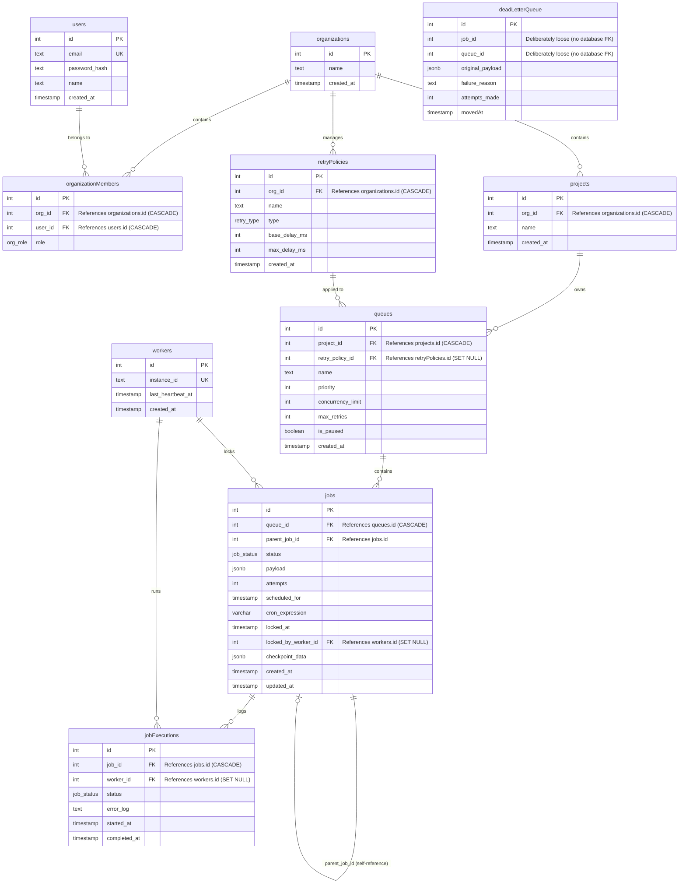

# Entity Relationship (ER) Diagram

This document contains the ER diagram showing all 10 tables in the Drizzle Postgres schema for CronCruise, including the exact foreign key relationships.

## Note on loose relationships
* **`deadLetterQueue` relationships:** The columns `deadLetterQueue.job_id` and `deadLetterQueue.queue_id` purposefully do not possess direct foreign keys. This guarantees that audit trails are preserved even if a job or its queue is permanently removed. Tenant isolation is maintained by resolving context through an explicit join through `queues → projects → organizations`.
